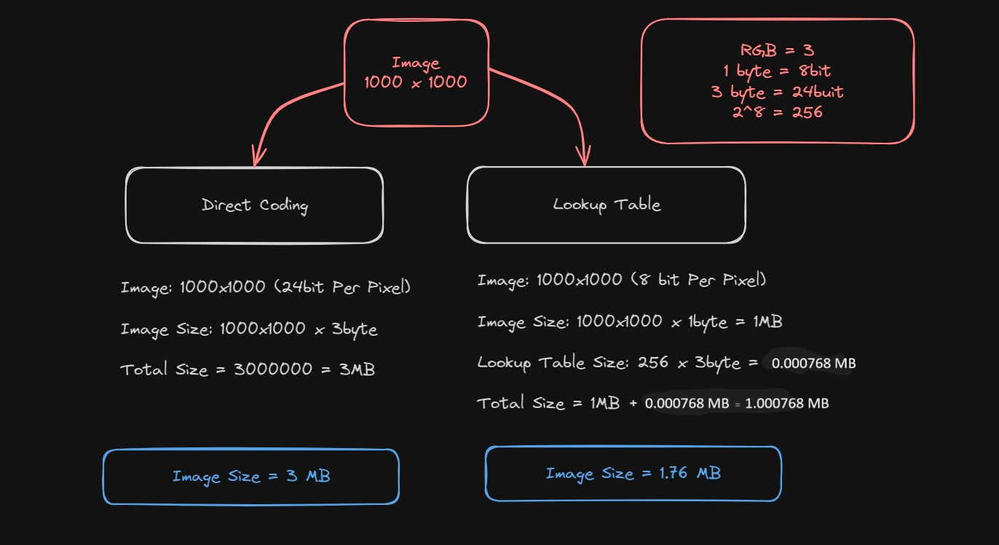
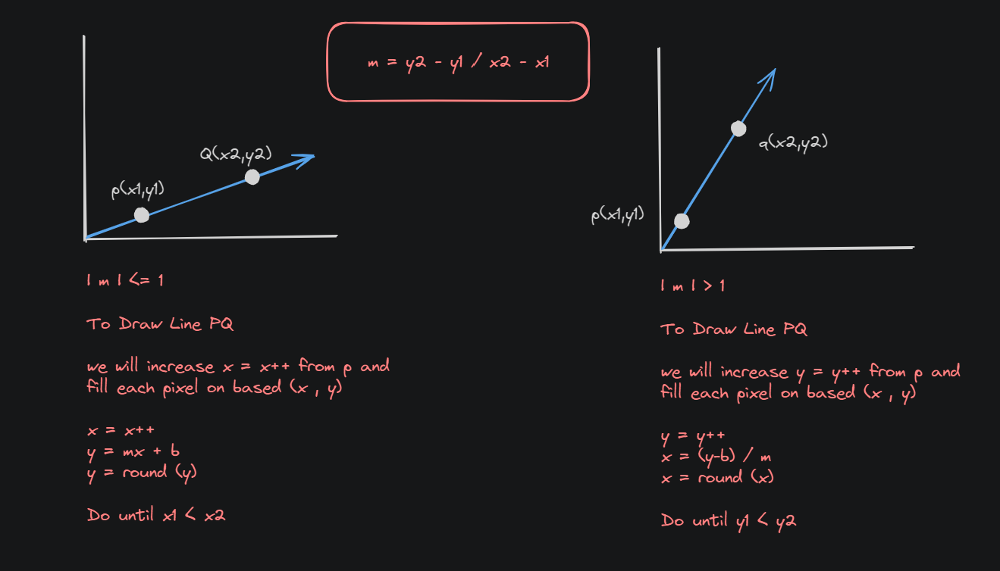
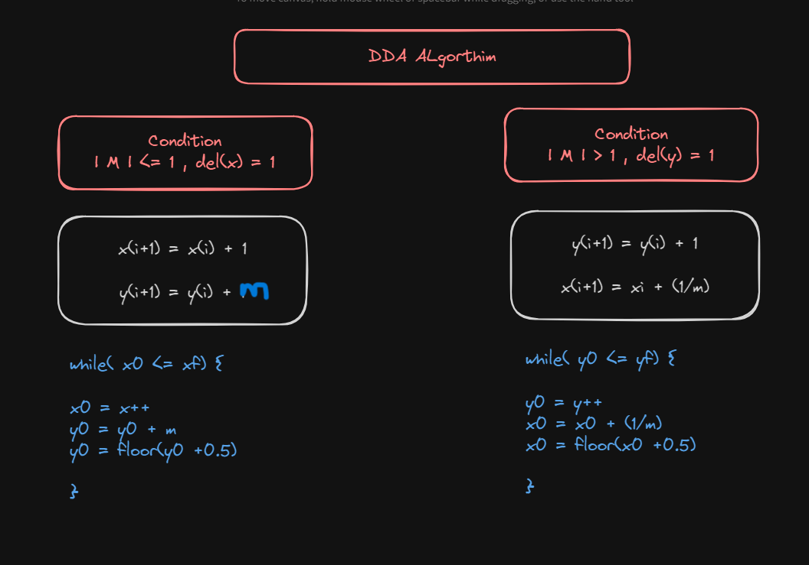
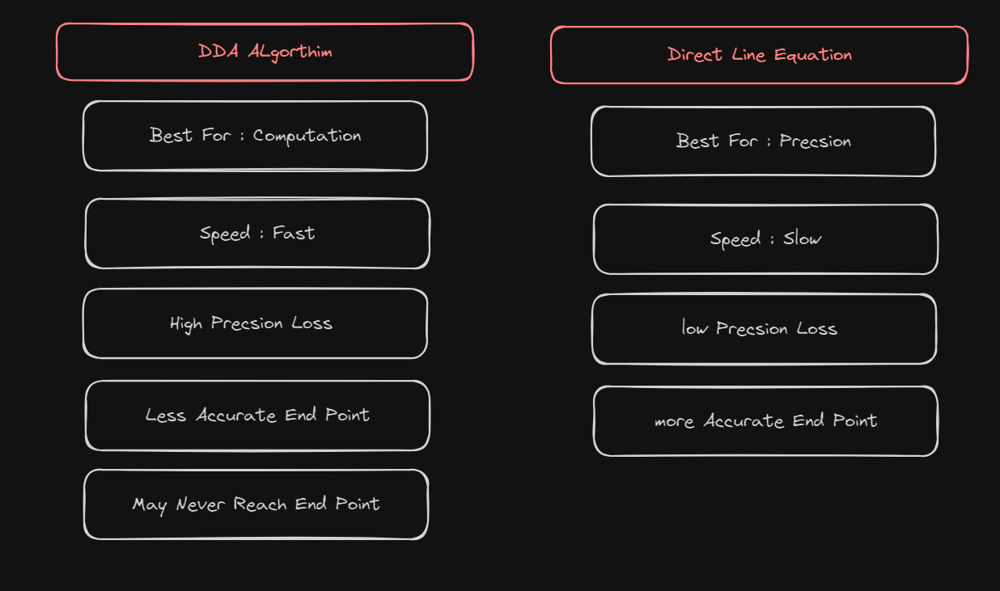
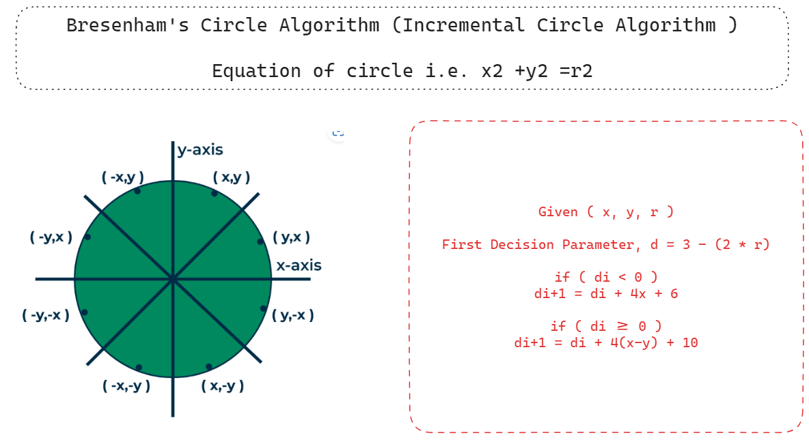
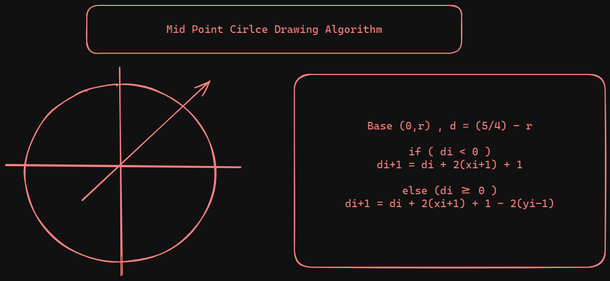
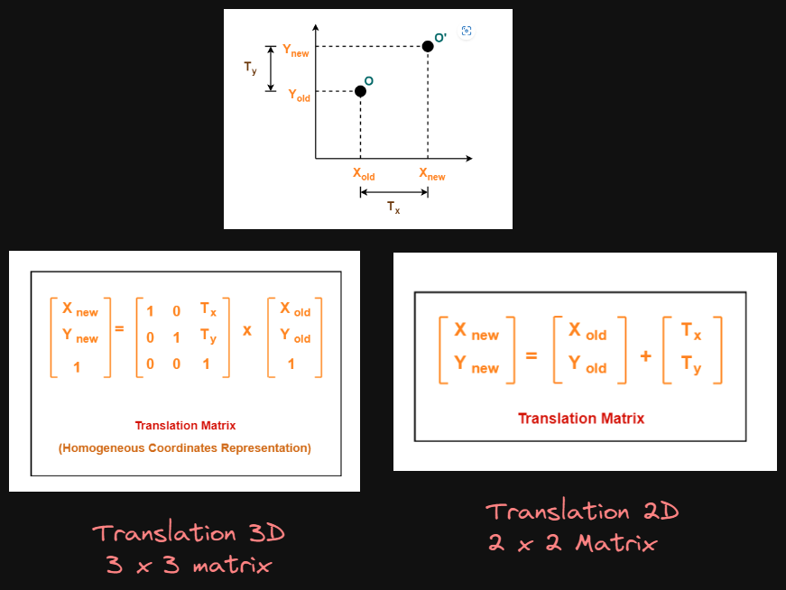
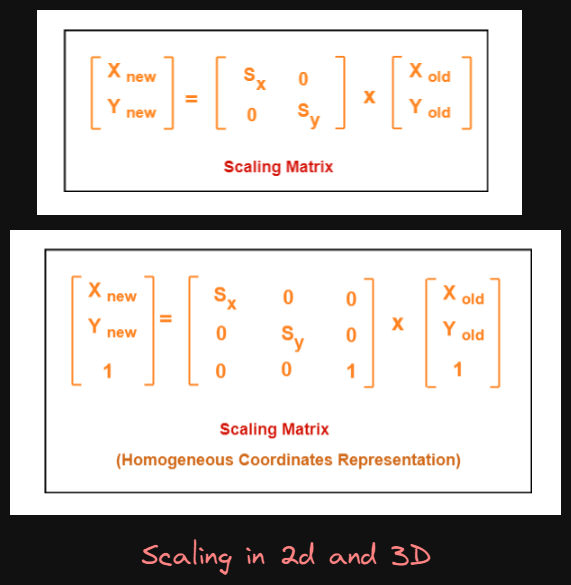
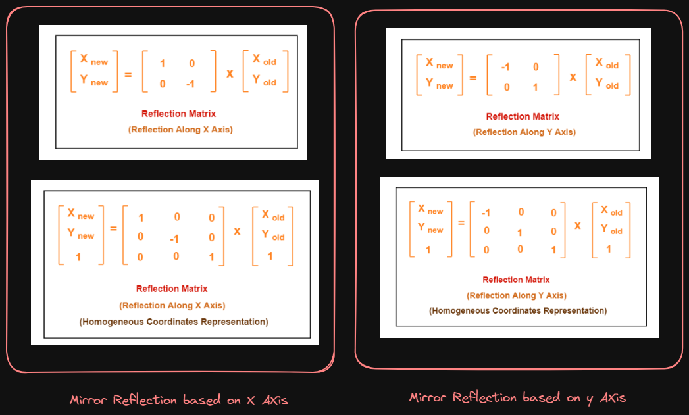
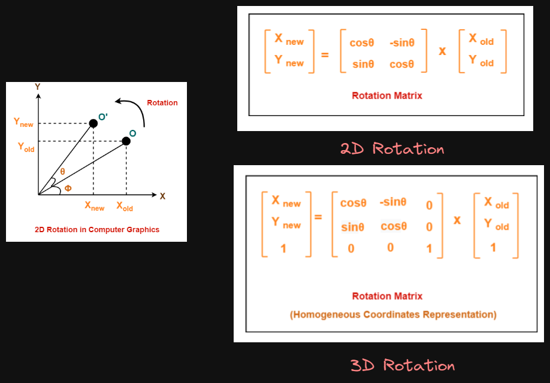

<div align = "center">

_------ **⭐⭐ Star The Repositry for Daily Updates ⭐⭐** ------_

## 🍂 Computer Graphics and Image Processing

| Section                       | Link                       |
| ----------------------------- | -------------------------- |
| 🍂 Theory Syllabus            | Chapter 1 - 5/6              |
| 🎅 Lab + Assignment Resources | [👉 Click Here](./Lab/)    |
| 😀 Book Resource              | [👉 Click Here](./Book/)   |
| 🎥 Class Lecture Slides       | [👉 Click Here](./Slides/) |
| 🦜 Final & Term Exam Notes    | [👉 Click Here](./Notes/)  |

## ⛑️ Others Useful Resources

_------ **⭐⭐ Anindo Vai Git ( [ 👉 Click Here](https://github.com/anindosarker/computer-graphics-algorithms-javascript) ) ⭐⭐** ------_

_------ **⭐⭐ FRR-Classroom-Link ( [ 👉 Click Here](https://classroom.google.com/u/0/c/NjU2Njk5NzQwMjQ5) ) ⭐⭐** ------_

_------ **⭐⭐ FRR-Drive-Link ( [ 👉 Click Here](https://drive.google.com/drive/folders/1PKGjHT_DGb4wNs-NTYjurEnndd-_Mrvr) ) ⭐⭐** ------_

_------ **⭐⭐ FRR-Github-Link ( [ 👉 Click Here](https://github.com/Fazle-Rakib/computer-graphics-and-image-processing) ) ⭐⭐** ------_

_------ **⭐⭐ FRR-Notebook-Link ( [ 👉 Click Here](https://colab.research.google.com/drive/1zQbNQ94JKvrr_xY5TBfazAMVv6pmw0HU#scrollTo=gu3HlTFFnUB7) ) ⭐⭐** ------_

</div>

## 🔍 Topic Covered in Classes

> 👉 Chapter 1 ( [ 👉 Click Here](./Slides/Basics%20of%20Computer.pptx) ) (Class - 1 : January 21)

- **✍️ What is Computer Graphics ?**
- **👉 What is Image ?**
- **👉 Why color range is (0-255) ?**
- **👉 Why 24bit is better than 8bit Channel ?**
- **👉 What is Pixel ?**
- **👉 What is Digital Image ?**
- **👉 What is Resolution ?**
- **👉 What is AR ?**
- **👉 What is VR ?**
- **👉 Difference Between AR & VR ?**
- **👉 PPI vs DPI ?**
- **👉 A 3x2 inch image at resolution of 300 pixels per inch would have a total pixels off ?**

> 👉 Chapter 2 ( [ 👉 Click Here](./Slides/02-color.pptx) ) (Class - 2 : January 24) [Digital Image Processing]

- **✍️ Color Image Processing ?**
- **👉 What is Color ?**
- **👉 Electromagnetic Spectrum**
- **👉 RGB Color Model**

```
 - Red = 8 bit , Green = 8 bit , Blue = 8 bit
 - Total RGB Colors = 2^24 = 16.7 Million
```

- **👉 CMY and CMYK Model**
- **👉 Direct Coding (⭐⭐⭐)**
- **👉 Lookup Table (⭐⭐⭐)**
- **👉 Direct Coding vs Lookup Table (⭐⭐⭐)**
- **👉 How Lookup Table reduce Image Size? (⭐⭐⭐)**



> 👉 Chapter 3 ( [ 👉 Click Here](./Slides/02-color.pptx) ) (Class - 3 : January 28) [Scan Conversion]

- **✍️ What is Scan-Conversion / Rasterization ?**
- **👉 What is Graphics Primitive ?**
- **👉 Scan Converting a Point**

```
 👉 Round Pixed Cordinates Value
 x' = floor (x + 0.5)
 y' = floor (y + 0.5)
```

- **👉 Scan Converting a Line**

> 👉 Direct Line Equations



> 👉 Digital Differential Analyzer (DDA) Algorithm



> 👉 DDA vs Direct Line Equation



> 👉 Bresenham's Line Drawing Algorithm


> 👉 Bresenham's Circle Algorithm (Incremental Circle Algorithm)



> 👉 Midpoint Circle Drawing Algorithm



> 👉 Region Filling Method

- **Two Types**
  - **Pixel Level Region Filling**
  - **Geometric Region Filling**
- **Two Approaches**
  - **4 Point Approach**
  - **8 Point Approach**

<hr>

### 👉 Chapter 4 : (3 March) [2D Transformation]

> 👉 All Class Lecture of Chapter - 4 : ( [ 👉 Click Here](./Lectures/Chapter%204%20Lectures.pdf) )

> 👉 Outline

- **Why use 3x3 Matrix ?**
- **Matrix Concatenation Benifits**
- **Coordinate Transformation Formula (Scaling, Translation, Reflection, Rotation)**
- **Geometric Transformation Formula (Scaling, Translation, Reflection, Rotation)**
- **Coordinate Transformation vs Geometric Transformation**
- **Composite Transformation Matrix**

> 👉 Translation in 2d and 3d



> 👉 Scaling in 2d and 3d



> 👉 Mirror Reflection in 2d and 3d



> 👉 Rotation in 2d and 3d



<hr>

### 👉 Chapter 5 : (22 March) - 2D Transformation Viewing & Clipping

- **Lecture Note (Priya): ( [👉 Click Here](./Lectures/CGI%20Lecture.pdf) )**
